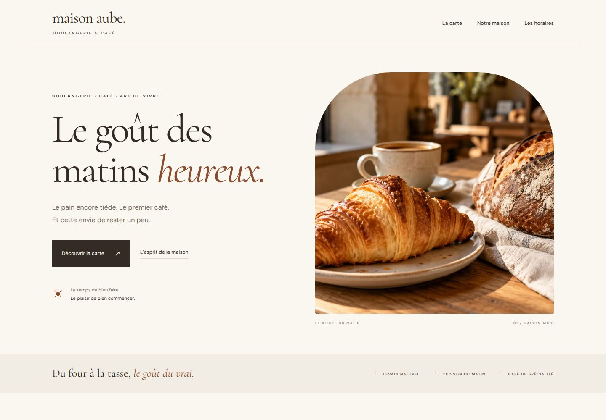

# Maison Aube — custom WordPress bakery theme



A fictional artisan bakery and café, designed and developed for Sara Branco’s portfolio. A premium editorial design with responsive layouts, original AI-generated concept photography, a filterable product menu, brand story, opening hours and FAQs.

**WordPress · Gutenberg · Full Site Editing · PHP · CSS · HTML · theme.json**

- [Visual preview](https://sarabranco.xyz/projects/maison-aube/)
- [Try the real theme in WordPress](https://sarabranco.xyz/projects/maison-aube/wordpress.html)
- [Sara’s portfolio](https://sarabranco.xyz)

## What this demonstrates

A complete custom block theme, native editable text and layout blocks, reusable header/footer, a homepage pattern, blog index, single post/page and 404 templates, responsive styling, keyboard focus, skip navigation and reduced-motion support. Self-hosted fonts, keyboard-friendly mobile navigation and an explicit designer contact invitation. No page-builder dependency, tracking, payment or fake client testimonials.

Maison Aube is a fictional brand. Prices and opening hours are illustrative. The contact link intentionally connects prospective web clients to Sara, and is labelled accordingly.

## Install

On WordPress 6.6 or later: Appearance → Themes → Add New → Upload Theme → select `maison-aube-theme.zip` → activate. Open Appearance → Editor to edit the homepage and global styles. The front-page template displays the bakery homepage automatically. The index template displays posts when used as a posts page; assign a separate posts page in Settings → Reading if desired.

The repository includes the theme source under `theme/maison-aube`, an installable ZIP, `blueprint.json` for a temporary WordPress Playground session, and a separate static preview in `preview/`. The static preview shows the visual design; it does not run PHP or the WordPress administration interface.

## Local preview

```sh
python3 -m http.server 8000 --directory preview
```

Open http://localhost:8000/. To test the actual theme, install it in a local WordPress installation or use the Playground link. No build or npm dependencies are required by the theme.

## Editing and deployment

Read [the project guide](docs/PROJECT_GUIDE.md). WordPress needs PHP and a database on normal hosting; the static portfolio hosts the preview and theme download, while Playground runs a temporary WordPress instance in the browser. It is not production hosting for a bakery.

## About Sara

Web developer based in Bayonne, working in French, Portuguese and English.
[Portfolio](https://sarabranco.xyz) · [GitHub](https://github.com/sarabranco92) · [Email](mailto:sbdev42@gmail.com)

## License

GPL-2.0-or-later. Original design created for this project. AI-generated concept photographs are disclosed in the website footer. Font licenses and visual asset provenance are documented in [ASSETS.md](docs/ASSETS.md).
